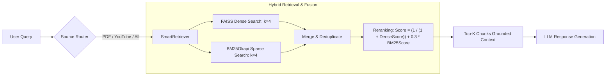
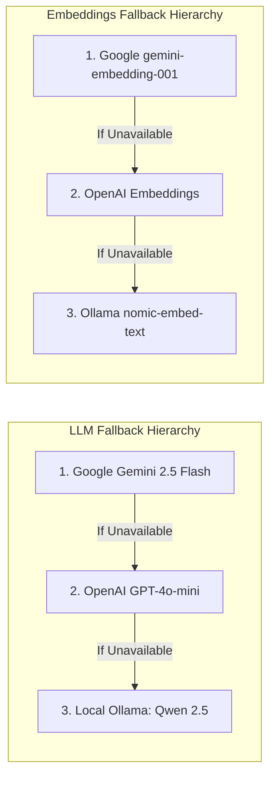
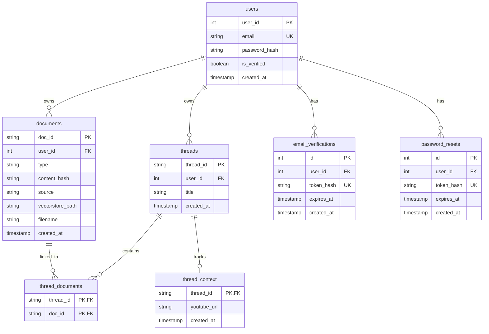

# 🤖 CortexAI — LangGraph Multi-Tool Hybrid RAG Chatbot

[](https://www.python.org/)
[](https://github.com/langchain-ai/langgraph)
[](https://github.com/langchain-ai/langchain)
[](https://fastapi.tiangolo.com/)
[](https://streamlit.io/)
[](https://github.com/facebookresearch/faiss)
[](https://opensource.org/licenses/MIT)

**CortexAI** is an advanced, production-grade conversational AI assistant powered by **LangGraph**, **FastAPI**, and **Streamlit**. It features a **Hybrid RAG** engine (Dense Vector + BM25 Sparse Search) over multimodal sources (PDF documents and YouTube video transcripts), a resilient **multi-provider LLM fallback chain** (Gemini $\to$ OpenAI $\to$ Ollama), an extensible **multi-tool agent suite**, persistent **SQLite checkpointing & session memory**, and secure **JWT authentication** with email verification.

---

## 📑 Table of Contents

- [Key Features](#-key-features)
- [Architecture Overview](#-architecture-overview)
- [Multi-Tool Ecosystem](#-multi-tool-ecosystem)
- [Hybrid RAG Pipeline](#-hybrid-rag-pipeline)
- [Resilient LLM & Embedding Fallbacks](#-resilient-llm--embedding-fallbacks)
- [Directory Structure](#-directory-structure)
- [Tech Stack](#-tech-stack)
- [Getting Started](#-getting-started)
  - [Prerequisites](#prerequisites)
  - [Installation](#installation)
  - [Configuration (`.env`)](#configuration-env)
- [Running the Application](#-running-the-application)
- [API Documentation](#-api-documentation)
- [Frontend Walkthrough](#-frontend-walkthrough)
- [Database Schema](#-database-schema)
- [Contributing & License](#-contributing--license)

---

## 🌟 Key Features

- 🧠 **LangGraph Agentic Loop**: Cyclical tool-calling graph with automated message state management and checkpointing.
- 📄 **Hybrid RAG over Documents & YouTube**:
  - Ingests and indexes PDFs and YouTube video transcripts.
  - Combines **FAISS Dense Similarity Search** and **BM25Okapi Keyword Matching** with weighted score fusion and deduplication.
  - Content-hash-based document deduplication across threads and users.
  - Smart source router (`pdf` vs `youtube` query intent classification).
- 🛠️ **Multi-Tool Agent Capabilities**:
  - **Unified RAG**: Multi-document and video context-grounded reasoning.
  - **Live Web Search**: Tavily Search with LRU caching and DuckDuckGo failover.
  - **Stock Market Ticker**: Real-time quotes via Alpha Vantage API.
  - **Python Executor**: Sandboxed Python code execution and stdout capture.
  - **Arithmetic Calculator**: Safe mathematical calculation tool.
- 🔄 **Self-Healing LLM & Embedding Fallbacks**:
  - Primary: Google Gemini (`gemini-2.5-flash` / `gemini-embedding-001`)
  - Secondary: OpenAI (`gpt-4o-mini` / `text-embedding-ada-002`)
  - Offline / Local: Ollama (`qwen2.5:3b` / `nomic-embed-text`)
- 🔐 **Authentication & Security**:
  - Password hashing with **Bcrypt** and **Passlib**.
  - **JWT Bearer Token** authentication.
  - Email verification and password reset workflows via SMTP (**FastAPI-Mail**).
  - User-isolated threads, document stores, and vector indices.
- 💾 **Persistent SQLite Memory**:
  - Turn-by-turn conversation state persistence via `SqliteSaver`.
  - Automatic thread title generation on the first user message.
- 🖥️ **Streamlit Split-Pane Interface**:
  - Live chat pane with streaming-style turn responses and history persistence.
  - Split document / video pane featuring embedded PDF viewer and YouTube video player.
  - Thread switcher sidebar, new chat creation, and JSON chat history export.

---

## 🏗️ Architecture Overview

```mermaid
flowchart TB
    subgraph Client["Frontend Layer (Streamlit)"]
        UI[Streamlit Dual-Pane App]
        AuthUI[Auth Pages: Login / Signup / Reset]
        PDFViewer[PDF Document Viewer]
        YTPlayer[YouTube Player]
    end

    subgraph API["Backend Layer (FastAPI)"]
        RouterAuth["/auth/* (JWT, Email Verification)"]
        RouterChat["/chat & /new-thread & /threads"]
        RouterUpload["/upload-pdf & /set_youtube"]
    end

    subgraph Agent["LangGraph Orchestration"]
        State[ChatState]
        ChatNode[Chat / Planner Node]
        ToolsCond{Requires Tool?}
        ToolNode[Tool Executor Node]
    end

    subgraph Tools["Agent Tools"]
        RAGTool[Unified RAG Tool]
        SearchTool[Tavily / DuckDuckGo Search]
        StockTool[Alpha Vantage Stock Ticker]
        PyExec[Python Code Executor]
        CalcTool[Calculator]
    end

    subgraph RAG["Hybrid RAG Subsystem"]
        SmartRetriever[SmartRetriever (Dense + Sparse Fusion)]
        FAISS_DB[(FAISS Vector Stores)]
        BM25_Index[BM25Okapi Keyword Index]
    end

    subgraph Storage["Data & Memory"]
        SQLite[(SQLite Database: chatbot_conv.db)]
        Checkpointer[SqliteSaver Checkpointer]
    end

    UI -->|REST API Requests| API
    RouterAuth -->|User Auth & Verification| SQLite
    RouterChat -->|Invoke Agent| Agent
    ChatNode --> ToolsCond
    ToolsCond -- "Yes" --> ToolNode
    ToolsCond -- "No / Final Answer" --> State
    ToolNode --> Tools
    RAGTool --> SmartRetriever
    SmartRetriever --> FAISS_DB
    SmartRetriever --> BM25_Index
    ToolNode --> ChatNode
    Agent --> Checkpointer
    Checkpointer --> SQLite
```

---

## 🛠️ Multi-Tool Ecosystem

The agent dynamically evaluates user intent and dispatches tasks to specialized tools:

| Tool Name | Module | Description | Fallback / Mechanism |
| :--- | :--- | :--- | :--- |
| **`unified_rag_tool`** | `app/tools/unified_rag_tool.py` | Answers queries grounded in uploaded PDFs or YouTube transcripts linked to the thread. | Source routing (`pdf` / `youtube`) + Hybrid Search |
| **`search_tool`** | `app/tools/search_tool.py` | Real-time web search for current events and external knowledge. | Tavily Search $\to$ DuckDuckGo Search (LRU cached) |
| **`get_stock_price`** | `app/tools/stock_tool.py` | Retrieves stock quotes, percentage changes, and trading data. | Alpha Vantage `GLOBAL_QUOTE` API |
| **`python_executor`** | `app/tools/python_executor.py` | Runs Python code snippets and captures standard output. | `contextlib.redirect_stdout` sandboxed execution |
| **`calculator`** | `app/tools/calculator_tool.py` | Performs arithmetic operations (`add`, `sub`, `mul`, `div`). | Zero-division protection |

---

## 🔍 Hybrid RAG Pipeline



1. **Ingestion & Content Deduplication**:
   - **PDFs**: Split into chunks with `RecursiveCharacterTextSplitter` (chunk size: 1000, overlap: 200). SHA-256 content hashes prevent duplicate vector store generation across users.
   - **YouTube**: Video transcripts fetched via `youtube_transcript_api`, converted to text chunks, and indexed.
2. **Hybrid Search (`SmartRetriever`)**:
   - **Dense Retrieval**: Cosine similarity against FAISS indices.
   - **Sparse Retrieval**: BM25 tokenized keyword scoring over indexed chunks.
3. **Score Fusion & Reranking**:
   - Combines normalized dense and sparse scores:
     $$\text{Final Score} = \frac{1}{1 + \text{Dense Score}} + 0.3 \times \text{BM25 Score}$$
   - Removes duplicates and delivers the most relevant chunks to the agent.
4. **Thread-Level In-Memory Cache**:
   - Vector store instances and retrievers are cached in memory for low-latency multi-turn conversations.

---

## 🔄 Resilient LLM & Embedding Fallbacks

The application uses a custom `FallbackLLM` and adaptive embeddings loader to ensure high availability:



---

## 📁 Directory Structure

```text
langgraph_chatbot/
├── app/
│   ├── api/
│   │   ├── main.py                # FastAPI main entry point
│   │   └── routes.py              # Chat, thread, document, & upload endpoints
│   ├── auth/
│   │   ├── dependencies.py        # Current user dependency (JWT verification)
│   │   ├── email_service.py       # SMTP email dispatcher (verification/reset)
│   │   ├── jwt_utils.py           # JWT encoding and decoding utilities
│   │   ├── routes.py              # Signup, login, email verification routes
│   │   ├── schemas.py             # Pydantic auth schemas
│   │   ├── security.py            # Password hashing & verification
│   │   └── token_utils.py         # Token hashing utilities
│   ├── core/
│   │   ├── retriever.py           # SmartRetriever (FAISS + BM25 hybrid search)
│   │   ├── source_router.py       # Heuristic source detection (PDF vs YouTube)
│   │   ├── splitter.py            # Text splitting and chunking logic
│   │   └── vectorstore.py         # FAISS vector store creation & batching
│   ├── frontend/
│   │   ├── api_client.py          # Streamlit HTTP client wrapper
│   │   ├── app.py                 # Streamlit main entry point (modular)
│   │   ├── auth_ui.py             # Login, signup, and forgot password UI
│   │   ├── chat_ui.py             # Split-pane chat, PDF viewer, and video UI
│   │   ├── login.py               # Standalone login view
│   │   ├── signup.py              # Standalone signup view
│   │   └── streamlit_app.py       # Single-file Streamlit alternative
│   ├── graph/
│   │   ├── agent_graph.py         # LangGraph StateGraph definition & compilation
│   │   ├── nodes.py               # Chat node & tool executor node
│   │   └── state.py               # TypedDict ChatState definition
│   ├── llm/
│   │   ├── embeddings.py          # Adaptive embeddings loader
│   │   ├── llm_config.py          # Runtime FallbackLLM implementation
│   │   └── title_generator.py     # Automatic chat title generation
│   ├── memory/
│   │   ├── sqlite_memory.py       # SQLite database initialization & helpers
│   │   └── thread_titles.py       # Thread title persistence helpers
│   ├── schemas/
│   │   ├── auth_schema.py         # Auth request & response schemas
│   │   └── chat.py                # Chat request schemas
│   ├── services/
│   │   ├── chat_service.py        # Chat business logic
│   │   ├── email.py               # Email helpers
│   │   ├── pdf_ingest.py          # PDF parsing & FAISS indexing
│   │   ├── youtube_ingest.py      # YouTube transcript ingestion
│   │   └── youtube_loader.py      # YouTube video ID & transcript extraction
│   ├── tools/
│   │   ├── calculator_tool.py     # Arithmetic calculation tool
│   │   ├── python_executor.py     # In-memory Python runner
│   │   ├── rag_tool.py            # Legacy RAG tool
│   │   ├── search_tool.py         # Tavily + DuckDuckGo search tool
│   │   ├── stock_tool.py          # Alpha Vantage stock ticker tool
│   │   ├── tools_registry.py      # Tool registry & discovery
│   │   └── unified_rag_tool.py    # Multi-source hybrid RAG tool
│   └── utils/
│       ├── common.py              # Message extraction and auth header helpers
│       ├── hash_utils.py          # SHA-256 byte & string hashing
│       └── logger.py              # Structured logging & latency measurement
├── data/                          # Uploaded PDFs and local vectorstore storage
├── database/                      # SQLite database files (chatbot_conv.db)
├── logs/                          # Application execution logs
├── main.py                        # Root FastAPI server entry point
├── requirements.txt               # Project dependencies
└── README.md                      # Project documentation
```

---

## 💻 Tech Stack

| Category | Technology |
| :--- | :--- |
| **Agent Orchestration** | [LangGraph](https://github.com/langchain-ai/langgraph), [LangChain Core](https://github.com/langchain-ai/langchain) |
| **LLM Providers** | Google Gemini API (`gemini-2.5-flash`), OpenAI API (`gpt-4o-mini`), Ollama (`qwen2.5:3b`) |
| **Embeddings** | Google Generative AI Embeddings, OpenAI Embeddings, Ollama (`nomic-embed-text`) |
| **Vector Database & Search** | [FAISS](https://github.com/facebookresearch/faiss), [rank-bm25](https://github.com/dorianbrown/rank_bm25) |
| **Backend Framework** | [FastAPI](https://fastapi.tiangolo.com/), [Uvicorn](https://www.uvicorn.org/) |
| **Frontend Framework** | [Streamlit](https://streamlit.io/), [PyMuPDF](https://github.com/pymupdf/PyMuPDF) (fitz) |
| **Authentication & Security** | [python-jose](https://github.com/mpdavis/python-jose) (JWT), [passlib](https://passlib.readthedocs.io/), [bcrypt](https://github.com/pyca/bcrypt) |
| **Database & Persistence** | [SQLite3](https://www.sqlite.org/), `langgraph-checkpoint-sqlite` |
| **External Integrations** | [Tavily Search API](https://tavily.com/), [DuckDuckGo Search](https://duckduckgo.com/), [Alpha Vantage API](https://www.alphavantage.co/), [YouTube Transcript API](https://github.com/jdepoix/youtube-transcript-api), [FastAPI-Mail](https://github.com/sabuhish/fastapi-mail) |

---

## 🚀 Getting Started

### Prerequisites

- **Python 3.10+** installed
- *(Optional)* [Ollama](https://ollama.ai/) installed if using local offline models (`ollama pull qwen2.5:3b` and `ollama pull nomic-embed-text`)

### Installation

1. **Clone the repository:**
   ```bash
   git clone https://github.com/MAbdullah005/CortexAI.git
   cd CortexAI
   ```

2. **Create and activate a virtual environment:**
   ```bash
   # Windows (PowerShell)
   python -m venv myenv
   .\myenv\Scripts\Activate.ps1

   # Linux / macOS
   python3 -m venv myenv
   source myenv/bin/activate
   ```

3. **Install dependencies:**
   ```bash
   pip install -r requirements.txt
   ```

---

### Configuration (`.env`)

Create a `.env` file in the root directory and configure the required environment variables:

```env
# ============================================================
# LLM & EMBEDDING API KEYS
# ============================================================
Gemini_API_Key=your_google_gemini_api_key
OPENAI_API_KEY=your_openai_api_key

# ============================================================
# AGENT TOOL API KEYS
# ============================================================
TAVILY_API_KEY=your_tavily_api_key
ALPHA_VANTAGE_API_KEY=your_alpha_vantage_api_key

# ============================================================
# JWT AUTHENTICATION
# ============================================================
JWT_SECRET_KEY=generate_a_secure_random_secret_key_here
JWT_ALGORITHM=HS256
ACCESS_TOKEN_EXPIRE_MINUTES=60

# ============================================================
# EMAIL / SMTP CONFIGURATION (FastAPI-Mail)
# ============================================================
MAIL_USERNAME=your_email@gmail.com
MAIL_PASSWORD=your_app_password
MAIL_FROM=your_email@gmail.com
MAIL_SERVER=smtp.gmail.com
MAIL_PORT=587

# ============================================================
# APPLICATION URLS
# ============================================================
BACKEND_URL=http://127.0.0.1:8000
```

---

## ⚡ Running the Application

To run the complete system, launch both the FastAPI backend and Streamlit frontend in separate terminal tabs:

### 1. Start the FastAPI Backend
```bash
uvicorn main:app --reload --host 127.0.0.1 --port 8000
```
- API Root: `http://127.0.0.1:8000`
- Interactive Swagger API Docs: `http://127.0.0.1:8000/docs`
- ReDoc API Docs: `http://127.0.0.1:8000/redoc`

### 2. Start the Streamlit Frontend
```bash
streamlit run app/frontend/app.py
```
- Web Application: `http://localhost:8501`

---

## 📡 API Documentation

### 🔐 Authentication Endpoints (`/auth`)

| Method | Endpoint | Description |
| :--- | :--- | :--- |
| `POST` | `/auth/signup` | Register a new user and dispatch a verification email. |
| `POST` | `/auth/login` | Authenticate user credentials and return a JWT access token. |
| `GET` | `/auth/me` | Retrieve the authenticated user's profile. |
| `GET` | `/auth/verify-email?token=...` | Verify user email address with a 15-minute token. |
| `POST` | `/auth/forgot-password` | Request a password reset email link. |
| `POST` | `/auth/reset-password` | Reset account password using the verification token. |

### 💬 Chat & Thread Endpoints

| Method | Endpoint | Description |
| :--- | :--- | :--- |
| `POST` | `/chat` | Send a prompt to the LangGraph agent for a specific `thread_id`. |
| `GET` | `/threads` | List all conversation threads owned by the authenticated user. |
| `POST` | `/new-thread` | Create a new isolated conversation thread. |
| `POST` | `/generate-title` | Auto-generate a title based on the first prompt. |
| `GET` | `/thread/{thread_id}/details` | Fetch thread message history, title, and attached documents. |

### 📄 Document & Video Ingestion

| Method | Endpoint | Description |
| :--- | :--- | :--- |
| `POST` | `/upload-pdf` | Upload and index a PDF document into the thread's vectorstore. |
| `POST` | `/set_youtube` | Ingest and index a YouTube video transcript for the thread. |
| `GET` | `/get_pdf/{thread_id}/{doc_id}` | Retrieve and stream the raw PDF file. |
| `GET` | `/get_youtube/{thread_id}` | Retrieve YouTube URLs associated with the thread. |
| `GET` | `/thread/{thread_id}/documents` | List all documents and video resources attached to the thread. |

---

## 🖥️ Frontend Walkthrough

```text
+----------------------------------------------------------------------------------------------------+
|  CORTEX AI — SPLIT-SCREEN WORKSPACE                                                                |
+------------------------------+---------------------------------------------------------------------+
|  SIDEBAR                     |  MAIN VIEW                                                          |
|  --------------------------- |  -----------------------------------------------------------------  |
|  [+ New Chat]                |  [ 🎥 Video & 📄 Document Preview ]  |  [ 💬 Chat Assistant ]       |
|                              |                                     |                             |
|  📄 Upload PDF               |  +--------------------------------+ |  👤 User: Summarize the     |
|  [ Choose file... ]          |  | [ Embedded PDF Viewer /         | |         uploaded PDF.       |
|                              |  |   YouTube Video Player ]        | |                             |
|  🎥 YouTube URL              |  |                                 | |  🤖 AI: Based on the      |
|  [ https://youtu.be/... ]    |  |                                 | |         document...         |
|                              |  +--------------------------------+ |                             |
|  🗂️ Past Conversations       |  [ Resize Slider: 50% / 50% ]       |  [ Type your prompt...   ]  |
|  • Research Notes            |                                     |  [ 💾 Download History ]    |
|  • Tech Stock Analysis       |                                     |                             |
+------------------------------+---------------------------------------------------------------------+
```

1. **Authentication Flow**: Users register, receive an email verification link, and sign in with JWT session persistence.
2. **Dynamic Workspaces**: Each conversation thread is an isolated workspace supporting multiple attached PDFs and YouTube videos.
3. **Split Screen**: Real-time adjustable slider allowing side-by-side viewing of documents/videos alongside the conversation.
4. **Chat Export**: Easily export complete conversation threads into formatted JSON files.

---

## 🗄️ Database Schema

The SQLite database (`database/chatbot_conv.db`) maintains the following structure:



---

## 🤝 Contributing & License

Contributions, issues, and feature requests are welcome!

1. Fork the repository
2. Create your feature branch (`git checkout -b feature/amazing-feature`)
3. Commit your changes (`git commit -m 'feat: Add amazing feature'`)
4. Push to the branch (`git push origin feature/amazing-feature`)
5. Open a Pull Request

This project is licensed under the **MIT License**.
